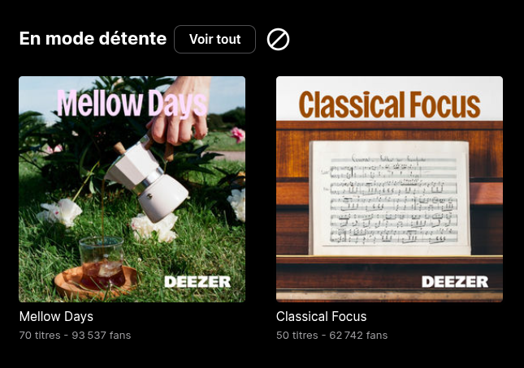
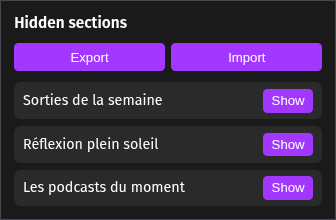
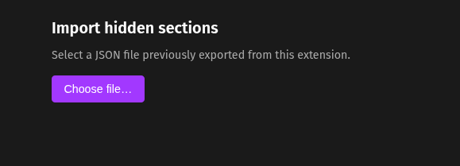

<h2 align="center">
  <br>
  <b>Deezer Hide Sections</b>
</h2>
<h4 align="center">Browser extension — hide unwanted sections on Deezer, persistently.</h4>

<p align="center">
  
  
  
  
</p>

<hr>
<p align="center">
  <a href="#features">Features</a> &bull;
  <a href="#installation">Installation</a> &bull;
  <a href="#usage">Usage</a> &bull;
  <a href="#project-structure">Project Structure</a>
</p>
<hr>

Lightweight content script that injects a **hide button** next to every section title on `deezer.com`. Hidden sections are persisted in browser storage — they stay hidden across reloads and navigation.

## Screenshots

<p align="center">
  
  
  
</p>

## Features

- **One-click hide** — hide button injected next to every section title
- **Restore panel** — popup lists hidden sections by title; one click to show again
- **Export / Import** — back up hidden sections to a JSON file and restore them on another browser
- **Persistent** — hidden sections stored locally, survive page reloads
- **Live sync** — restoring from the popup reveals the section without a reload
- **Dynamic** — `MutationObserver` handles Deezer's lazy-loaded content
- **Zero dependencies** — plain JS + CSS, no build step required
- **Cross-browser** — works on Chrome (MV3) and Firefox (109+)

## Installation

### Via Releases (Recommended)

1. Download the latest ZIP version from the [Releases](https://github.com/tblt-gr/deezer-hide-sections/releases) tab.
2. Extract the archive on your computer.
3. Follow the instructions below based on your browser.

### Chrome

1. Go to `chrome://extensions`
2. Enable **Developer mode**
3. Click **Load unpacked** → select this folder

### Firefox

1. Go to `about:debugging#/runtime/this-firefox`
2. Click **Load Temporary Add-on** → select `manifest.json`

## Usage

**Hide** — click the **⊘** button next to any section title.

**Restore** — click the extension icon in the toolbar to open the panel, then click **Show** next to the section you want back. It reappears instantly, no reload needed.

**Export** — open the panel and click **Export**. A `deezer-hidden-sections-<date>.json` file is downloaded, holding an `{ id: title }` map of every hidden section.

**Import** — open the panel and click **Import**. It opens a dedicated page where you select a previously exported JSON file; the sections are merged into your current list.

## Project Structure

```
├── manifest.json       Extension manifest (MV3)
├── content.js          Content script — injects buttons, handles hide logic
├── content.css         Styles for the hide button and hidden state
├── popup/
│   ├── popup.html      Restore panel markup
│   ├── popup.css       Panel styles
│   └── popup.js        Lists hidden sections, handles restore & export
├── import/
│   ├── import.html     Import page markup
│   ├── import.css      Import page styles
│   └── import.js       Reads a JSON file, merges sections into storage
└── icons/
    ├── hide-button.svg Hide button icon (injected into page)
    ├── icon16.png
    ├── icon48.png
    └── icon128.png
```